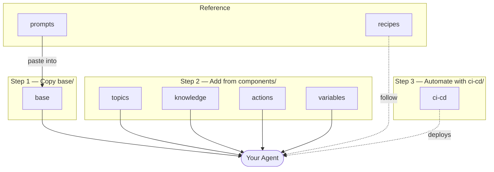

# Copilot Studio Templates

Reusable YAML templates for building production-quality Copilot Studio agents.
Every topic has built-in error handling, telemetry, and CSAT — nothing to add manually.

---

## Where to start

### 🎯 **MASTER TUTORIAL — Start here!**

**→ [`docs/AGENT-DEVELOPER-JOURNEY.md`](docs/AGENT-DEVELOPER-JOURNEY.md)** (90–120 min) — Complete end-to-end walkthrough from setup to live agent deployment. 6 phases with troubleshooting, expected outputs, and next steps.

---

### 📚 Complete Guide Suite (6 Components)

| Component | Purpose | Time |
|-----------|---------|------|
| 📖 **Master Tutorial** | [`AGENT-DEVELOPER-JOURNEY.md`](docs/AGENT-DEVELOPER-JOURNEY.md) | 90–120 min |
| 🚀 **Deployment Options** | [`DEPLOYMENT-OPTIONS.md`](docs/DEPLOYMENT-OPTIONS.md) — Compare 3 ways to deploy | 15 min read |
| 🤖 **Setup Automation** | [`scripts/setup-agent-dev.ps1`](scripts/setup-agent-dev.ps1) (Windows) or [`setup-agent-dev.sh`](scripts/setup-agent-dev.sh) (macOS/Linux) | 5–10 min |
| ✅ **Printable Checklist** | [`AGENT-DEVELOPER-CHECKLIST.md`](docs/AGENT-DEVELOPER-CHECKLIST.md) | Follow along |
| 📊 **Visual Flowcharts** | [`VISUAL-FLOWCHARTS.md`](docs/VISUAL-FLOWCHARTS.md) | Print & reference |
| 📌 **Quick Reference Cards** | [`QUICK-REFERENCE-CARDS.md`](docs/QUICK-REFERENCE-CARDS.md) | Print & desk |

---

### Other Quick Entry Points

| Goal | Go to | Time |
|------|-------|------|
| **Copy templates step-by-step** | [`docs/COPY-AND-SETUP-TEMPLATES.md`](docs/COPY-AND-SETUP-TEMPLATES.md) | 30 min |
| **How to use Claude skills** | [`docs/SKILLS-QUICK-REFERENCE.md`](docs/SKILLS-QUICK-REFERENCE.md) | 10 min |
| **Find what you need** | [`docs/DOCUMENTATION-MAP.md`](docs/DOCUMENTATION-MAP.md) | — |
| **Quick overview** | [`docs/QUICKSTART.md`](docs/QUICKSTART.md) | 20 min |
| **Common Q&A** | [`docs/FAQ.md`](docs/FAQ.md) | 15 min |
| **Full enterprise delivery** | [`docs/START-HERE.md`](docs/START-HERE.md) & [`ENGINEERING-PLAYBOOK.md`](ENGINEERING-PLAYBOOK.md) | Varies |
| **Something is broken** | [`troubleshooting/README.md`](troubleshooting/README.md) | — |

---

## Folder structure

| Folder | What's inside | Go here when… |
|--------|--------------|---------------|
| [`base/`](base/) | 6 files every agent needs — agent, settings, Greeting, Fallback, OnError, OutOfScope | Starting a new agent |
| [`components/`](components/) | Drop-in topics, actions, knowledge sources, cards, variables | Adding a capability |
| [`recipes/`](recipes/) | Step-by-step guides for 8 common agent patterns | Choosing an agent architecture |
| [`prompts/`](prompts/) | System prompt templates + AI generation prompts | Writing the agent persona |
| [`examples/`](examples/) | End-to-end worked examples (IT Helpdesk) | Seeing a full build in context |
| [`project-delivery/`](project-delivery/) | Discovery → Design → Build → UAT documents (`00`–`13`) | Running a governed delivery |
| [`governance/`](governance/) | Responsible AI + security review checklists | Pre-go-live sign-off |
| [`launch/`](launch/) | Go-live checklist, user communication, hypercare guide | Shipping to production |
| [`operations/`](operations/) | KQL monitoring queries, alerts, runbook | Post-launch health and incidents |
| [`ci-cd/`](ci-cd/) | GitHub Actions pipelines for Dev → UAT → Prod | Setting up CI/CD |
| [`troubleshooting/`](troubleshooting/) | Common errors and fixes | Something is broken |
| [`commands/`](commands/) | Quick-reference command sheets (pac, git, VS Code) | Looking up a command |

---

## Reference docs

| File | What it covers |
|------|---------------|
| [`docs/COMPONENT-REGISTRY.md`](docs/COMPONENT-REGISTRY.md) | Call signatures, inputs, and outputs for every component |
| [`docs/TEMPLATES.md`](docs/TEMPLATES.md) | Full inventory of all 55 templates |
| [`ENGINEERING-PLAYBOOK.md`](ENGINEERING-PLAYBOOK.md) | Platform decision, setup, build, governance, CI/CD, telemetry, monitoring |
| [`docs/BEST-PRACTICES.md`](docs/BEST-PRACTICES.md) | Design rules, error handling, telemetry, naming |
| [`docs/TOOLS-AND-PLUGINS.md`](docs/TOOLS-AND-PLUGINS.md) | Install `pac` CLI, VS Code extensions, Copilot Studio Kit |
| [`docs/ACTION-SAFETY-PATTERNS.md`](docs/ACTION-SAFETY-PATTERNS.md) | Safety tiers and confirmation patterns for write actions |
| [`docs/ENV-VARIABLES.md`](docs/ENV-VARIABLES.md) | Environment variables: Power Platform env vars (CPS low-code) and Key Vault / App Config / Managed Identity (Azure pro-code) |
| [`docs/PII-SCRUBBING.md`](docs/PII-SCRUBBING.md) | PII prevention in telemetry, Power Fx masking, App Insights config, DLP policies |
| [`docs/SKILLS-REFERENCE.md`](docs/SKILLS-REFERENCE.md) | Claude skills for generating topics, running evals, validating YAML |
| [`docs/TEAM-GUIDE.md`](docs/TEAM-GUIDE.md) | Role-based entry points, onboarding for new developers |

---

## Conventions

| Convention | Rule |
|------------|------|
| `<AngleBrackets>` | Required placeholder — replace before use |
| `_REPLACE` suffixes | Node IDs — auto-replaced by VS Code extension on save |
| `schemaName` prefix | Every component ID starts with the agent's `schemaName` |
| One file per component | Never combine actions, knowledge, or child agents into one file |
| Feature branch only | Never work directly on `main` — use `feature/<agent-name>` |
