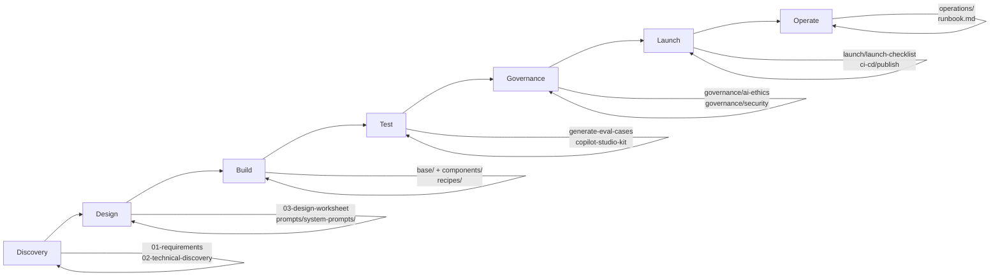

# Team Guide — Using These Templates in a Real Project

How a team picks up this repository on Day 1 and uses it across a full delivery sprint-by-sprint — from first ticket to production monitoring. Covers roles, workflow, branching, PR review, parallel development, and concrete story-to-template mapping.

---

## The Fundamental Promise

Every component in this repo eliminates boilerplate and reduces error risk:

| Without templates | With templates |
|-------------------|----------------|
| Build topic from scratch: 2–3 hours | Copy scaffold + fill placeholders: 20–30 min |
| Manually add telemetry to every topic | Telemetry built into every template |
| Forget error handling on a topic | Scaffold error handler included by default |
| YAML schema errors discovered at runtime | `pac copilot push --dry-run` catches them before push |
| Manual push to UAT/Prod by developers | CI/CD pipeline enforces promotion gates |
| No routing accuracy measurement | Eval CSV + Copilot Studio Kit gate ≥ 85% |

---

## Delivery Lifecycle — Which Template at Each Phase



### Phase map (which files each role touches)

| Phase | Files | Who | Gate |
|-------|-------|-----|------|
| Discovery | `project-delivery/01-requirements-questionnaire.md`, `02-technical-discovery.md` | Dev + Business Owner | Both complete before design starts |
| Design | `project-delivery/03-agent-design-worksheet.md`, `prompts/system-prompts/` | Tech Lead + Dev | FDD + TDD signed off |
| Build | `base/`, `components/`, `recipes/` | Dev | All placeholders replaced, `pac copilot push --dry-run` passes |
| Test | `project-delivery/05-eval-scenarios.md`, `prompts/ai-prompts/generate-eval-cases.md` | Dev + QA | Eval ≥ 85% routing accuracy |
| Governance | `governance/ai-ethics-checklist.md`, `governance/security-review.md` | Tech Lead + Security | Both signed — CI/CD will not promote without this |
| Launch | `launch/launch-checklist.md`, `ci-cd/publish-on-release.yml` | Dev + PM | All checklist items pass, manual approval in GitHub |
| Operate | `operations/monitoring-queries.md`, `operations/runbook.md` | Agent Owner | Alerts configured, weekly health check on cadence |

---

## Role Responsibilities — Who Does What

### In every sprint

| Role | Responsibilities in a build sprint | Files they own |
|------|-----------------------------------|---------------|
| **Junior dev** | Copy templates, replace placeholders, run smoke tests, write eval test cases | Individual topic files in `agents/<name>/topics/` |
| **Mid-level dev** | Add actions + knowledge sources, wire variables, set up CI/CD, write eval CSV | `components/`, `ci-cd/`, `agents/<name>/evals/` |
| **Senior dev / tech lead** | Architecture decisions, recipe selection, governance review, eval threshold, PR reviews | `recipes/`, `governance/`, `ci-cd/promote-*.yml` |
| **Business owner / domain SME** | Requirements input, UAT sign-off, governance sign-off | `project-delivery/01-requirements.md`, `governance/ai-ethics-checklist.md` |
| **DevOps / platform engineer** | Environment setup, service principal, GitHub secrets, connection references per env | `.github/workflows/`, `project-delivery/02-technical-discovery.md` |
| **Security reviewer** | Security review checklist, PII check, action safety tier validation | `governance/security-review.md`, `ACTION-SAFETY-PATTERNS.md` |
| **QA / tester** | UAT test plan execution, eval CSV review, adversarial prompt testing | `project-delivery/04-uat-test-plan.md`, `agents/<name>/evals/` |

### One-time project setup (tech lead + DevOps, Sprint 0)

```bash
# Step 1 — Fork or clone this repo into your organisation's Git
git clone <this-repo-url>
cd copilot-studio-templates

# Step 2 — Create branch protection on main
# GitHub → Settings → Branches → Add rule for "main":
# - Require pull request before merging
# - Require status checks to pass (push-on-pr workflow)
# - Require 1 approver

# Step 3 — Add GitHub secrets (DevOps does this)
# Settings → Secrets → Actions:
# DEV_ENVIRONMENT_URL, UAT_ENVIRONMENT_URL, PROD_ENVIRONMENT_URL
# POWER_PLATFORM_SPN_ID, POWER_PLATFORM_SPN_SECRET, POWER_PLATFORM_TENANT_ID

# Step 4 — Copy CI/CD pipelines
mkdir -p .github/workflows
cp ci-cd/push-on-pr.yml .github/workflows/
cp ci-cd/promote-dev-to-uat.yml .github/workflows/
cp ci-cd/publish-on-release.yml .github/workflows/

# Step 5 — Create team placeholder map (tech lead writes this)
# Create a file: agents/PLACEHOLDER-MAP.md with your project's values:
# <SCHEMA>                → yourorg_agentname
# <SHAREPOINT_SITE_URL>   → https://yourorg.sharepoint.com/sites/YourKB
# <EscalationQueueName>   → YourTeam-Support-Queue
```

---

## Story → Template Mapping

### Sprint planning: map every story to a template

This is the key habit. During sprint planning, the tech lead writes the template to use against every story. This removes ambiguity about what to build and how.

```
SPRINT PLANNING OUTPUT (example: IT Helpdesk v1.0)

Story 1: User can ask IT questions and get answers from knowledge base
  Template: components/topics/knowledge-search/ + components/knowledge/sharepoint/
  Owner: Dev A | Estimate: 2h | Claude skill: /copilot-studio:add-knowledge

Story 2: Agent greets users by their M365 name
  Template: components/topics/conversation-init/ + components/variables/user-display-name/
  Owner: Dev B | Estimate: 1h | Claude skill: /copilot-studio:new-topic

Story 3: Users can request escalation to IT support team
  Template: components/topics/escalation/
  Owner: Dev A | Estimate: 1h | Claude skill: /copilot-studio:new-topic

Story 4: Collect satisfaction rating after every answer
  Template: components/topics/feedback/ + components/adaptive-cards/feedback-thumbs.json
            components/adaptive-cards/feedback-rating.json + feedback-text.json
  Owner: Dev B | Estimate: 1.5h | Claude skill: /copilot-studio:add-adaptive-card

Story 5: Remove citation markers from knowledge search answers
  Template: components/topics/remove-citations/
  Owner: Dev A | Estimate: 30m | No skill needed — just copy and replace

Story 6: Redirect out-of-scope questions to HR portal
  Template: components/topics/out-of-scope/
  Owner: Dev B | Estimate: 30m | No skill needed

Story 7: Governance sign-off
  Documents: governance/ai-ethics-checklist.md + governance/security-review.md
  Owner: Tech Lead + Security Reviewer | Estimate: 2h | No template — process document

Story 8: Eval CSV with 50 test cases
  Prompt: prompts/ai-prompts/generate-eval-cases.md (run in Claude)
  Owner: Dev A | Estimate: 1h | Claude skill: /copilot-studio:create-eval
```

**Total sprint: ~10 hours of template-driven work. Without templates: 30–40 hours.**

### Full story → template lookup table

| Story type | Template to copy | Configuration needed |
|-----------|-----------------|---------------------|
| "Answer questions from SharePoint" | `components/topics/knowledge-search/` + `components/knowledge/sharepoint/` | Set SharePoint site URL |
| "Greet user by name" | `components/topics/conversation-init/` + `components/variables/user-display-name/` | Requires auth (Office 365 connection) |
| "Users can sign in" | `components/topics/auth/` | Set auth mode in `settings.mcs.yml` |
| "Escalate to human support" | `components/topics/escalation/` | Set `<EscalationQueueName>` |
| "Collect satisfaction feedback" | `components/topics/feedback/` + 3 feedback card JSONs | No config needed — works out of the box |
| "Submit a request / ticket" | `components/actions/connector/` + `components/topics/action-invoke/` | Set connector, operationId, inputs |
| "Call an MCP tool / external API" | `components/actions/mcp/` + `components/topics/action-invoke/` | Set MCP endpoint, tool name |
| "Remove [1][2] from answers" | `components/topics/remove-citations/` | No config — drop in and it works |
| "Redirect out-of-scope queries" | `components/topics/out-of-scope/` | Set `<OUT_OF_SCOPE_RESOURCE>` text |
| "Clarify when multiple topics match" | `components/topics/disambiguation/` | Add trigger phrases for ambiguous cases |
| "Collect form data from user" | `components/adaptive-cards/form-card.json` | Wire to a topic question node |
| "Confirm before a write action" | `components/adaptive-cards/confirmation-card.json` | Required for Medium/High safety tier |
| "Show action result with status" | `components/adaptive-cards/status-card.json` | Set status (success/warning/error) |
| "New custom topic" | `components/topics/_scaffold/` | Add trigger phrases + logic |
| "Specialist sub-agent" | `components/agents/child-agent/` | Set child agent endpoint + instructions |
| "Acronym glossary in context" | `components/knowledge/glossary/` + `components/variables/glossary-var/` | Upload CSV to Dataverse |

---

## Branching Strategy

Two patterns — choose based on team size and parallel workload.

### Pattern A — One branch per agent (small teams, 1–2 devs)

```
main  (protected — CI/CD only)
  └── feature/it-helpdesk-v1      ← all stories for this agent
       └── PR → main triggers CI/CD
```

**When to use:** Team of 1–2 devs on one agent. Simpler, less overhead.

**Risk:** PRs are large if multiple stories are done before merging. Keep stories small (1 template per PR).

### Pattern B — One branch per component (larger teams, parallel work)

```
main  (protected — CI/CD only)
  └── feature/it-helpdesk/base           ← 5 base files (Sprint 0, Day 1)
  └── feature/it-helpdesk/knowledge      ← knowledge source + search topic
  └── feature/it-helpdesk/escalation     ← escalation topic
  └── feature/it-helpdesk/csat           ← feedback topic + 3 cards
  └── feature/it-helpdesk/conversation-init  ← user profile loading
```

**When to use:** 3+ devs on one agent, or parallel work on different components.

**Benefit:** Small, focused PRs. Different devs never edit the same file simultaneously (each component is a separate file). Fast reviews.

**Merge order:** Always merge `base` branch first. All other branches depend on it.

### The merge-conflict-free guarantee

This works because of the one-file-per-component convention:
- `KnowledgeSearch.topic.mcs.yml` is one file → owned by one dev
- `Escalation.topic.mcs.yml` is one file → owned by a different dev
- `Feedback.topic.mcs.yml` is one file → owned by a third dev

Three devs never edit the same file. Merge conflicts are structurally prevented.

---

## The Developer Workflow — Story to Production

Every story follows this exact sequence. There are no exceptions.

### Step 1 — Create your branch

```bash
git checkout main
git pull origin main
git checkout -b feature/it-helpdesk/<story-slug>
# Example: feature/it-helpdesk/knowledge-search
```

### Step 2 — Copy the template

```bash
# Replace <template-path> and <your-agent> with your values
cp components/topics/<template-folder>/<Template>.topic.mcs.yml \
   agents/<your-agent>/topics/<Template>.topic.mcs.yml

# For knowledge sources:
cp components/knowledge/sharepoint/sharepoint.knowledge.mcs.yml \
   agents/<your-agent>/knowledge/<Name>.knowledge.mcs.yml
```

### Step 3 — Replace all placeholders

```bash
# Replace <SCHEMA> everywhere in the agent folder
find agents/<your-agent> -name "*.mcs.yml" \
  -exec sed -i 's/<SCHEMA>/<your-schemaname>/g' {} \;

# Then replace other placeholders specific to this story
# e.g., set <EscalationQueueName>, <SHAREPOINT_SITE_URL>, etc.
grep -rn "<" agents/<your-agent> --include="*.yml"
# Every remaining < must be intentional — replace all of them
```

### Step 4 — Validate before pushing

```bash
pac copilot push --dry-run
# Must return 0 errors before proceeding
# If errors: read the error message — it will say which file and line
```

### Step 5 — Push to Dev

```bash
# Confirm you are on your Dev environment (never UAT or Prod)
pac auth list
# Active (*) entry must show your Dev org URL

pac copilot push
```

### Step 6 — Smoke test in Copilot Studio

1. Open Copilot Studio → your agent → Test
2. Turn on Activity log (bottom panel)
3. Test the specific topic you added — does it trigger? Does it respond?
4. Check Activity log: correct topic name in `triggeredBy`? Telemetry event fires?

### Step 7 — Open a PR

```bash
git add agents/<your-agent>/topics/<Template>.topic.mcs.yml
git add agents/<your-agent>/knowledge/<Name>.knowledge.mcs.yml  # if added
git commit -m "feat: add knowledge search topic with SharePoint KB"
git push origin feature/it-helpdesk/knowledge-search
# Open PR in GitHub
```

PR title convention: `feat: add <component-name>` or `fix: correct <issue>`

### Step 8 — PR review (reviewer checklist)

**The reviewer runs this before approving any YAML PR:**

```bash
# 1. No unreplaced placeholders
grep -rn "_REPLACE\|<" <changed-files> --include="*.yml"
# Must return zero output

# 2. No PII in telemetry nodes
grep -n "UserDisplayName\|UserEmail\|EmployeeId" <changed-topics> --include="*.yml"
# Any match inside LogCustomTelemetryEvent value = reject the PR

# 3. Scaffold was used for new topics
# Open the topic file: does it contain LogCustomTelemetryEvent at the start?
# If not: this was not built from _scaffold — send back for rework

# 4. Write actions have confirmation cards
# Check ACTION-SAFETY-PATTERNS.md tier for any new connector action
# Medium tier: must have confirmation-card step before executing
```

### Step 9 — CI/CD does the rest

Once the PR is approved and merged to main:
- `promote-dev-to-uat.yml` automatically pushes to UAT and runs the eval gate
- If eval ≥ 85%: UAT environment is updated
- If eval < 85%: pipeline fails, Dev lead gets notified, story is not promoted

---

## Parallel Development — Two Teams, Two Agents

When two teams build two different agents simultaneously (e.g., IT Helpdesk + HR Assistant):

### Repository structure

```
agents/
  it-helpdesk/         ← Team A
    topics/
    knowledge/
    variables/
    evals/
  hr-assistant/        ← Team B
    topics/
    knowledge/
    variables/
    evals/
```

### Key rules for parallel teams

1. **Different `schemaName` per agent** — `contoso_ithelpdesk` and `contoso_hrassistant`. Set this in `settings.mcs.yml` first, before sharing files with anyone.

2. **Separate Dev environments** — each team gets their own Dev Power Platform environment. They never share Dev environments.

3. **Same UAT, different agents** — both agents can coexist in the same UAT environment as they have unique `schemaName` values.

4. **Components are copied, not shared** — Team A copies `components/topics/escalation/` into `agents/it-helpdesk/`. Team B copies it independently into `agents/hr-assistant/`. They do not share files. If one team modifies their copy, it doesn't affect the other.

5. **Common component improvements go back to `components/`** — if Team A improves the escalation topic (e.g., adds a new trigger phrase), they open a PR to update `components/topics/escalation/` so Team B can pull the improvement too.

---

## Eval CSV — Team Workflow

The eval CSV is owned by the dev team and lives in the repo. It grows every sprint.

### Where it lives

```
agents/it-helpdesk/evals/
  it-helpdesk-routing.csv    ← routing accuracy eval (50+ rows minimum)
  it-helpdesk-knowledge.csv  ← knowledge answer quality (optional)
```

### Who creates it

1. **Tech lead** seeds it with 10 cases during design (covers P0 scenarios)
2. **Dev** adds cases as they build each topic (3 cases per new topic)
3. **QA / tester** adds adversarial and edge cases before UAT (10+ cases)
4. **Agent Owner** adds new cases monthly based on `Knowledge.AnswerNotFound` telemetry

### How to generate cases fast

```bash
# Use the AI prompt — paste into Claude
cat prompts/ai-prompts/generate-eval-cases.md
# Fill in: topic list, trigger phrases, knowledge subject, out-of-scope areas
# Returns: 50-row CSV ready to use
```

### CI/CD gate

The pipeline reads `agents/<name>/evals/<name>-routing.csv` and fails the UAT promotion if accuracy < 85%. This means:
- Adding a new topic without adding eval cases → accuracy drops → UAT promotion blocked
- Every new topic must have at least 3 eval rows before the PR merges

---

## Governance — Team Integration

Governance is not a one-time sign-off. It is woven into the delivery.

### When governance happens

```
DESIGN phase:
  Tech lead reads: governance/enterprise-ai-governance-framework.md
  This shapes decisions about: scope, out-of-scope redirect, confirmation cards for write actions

BUILD phase:
  Every developer applies: ACTION-SAFETY-PATTERNS.md (safety tier for every action)
  Every developer follows: PII rule (never log displayName/email in telemetry)

PRE-UAT:
  governance/ai-ethics-checklist.md — completed by tech lead, signed by business owner
  governance/security-review.md — completed by developer, signed by security reviewer

CI/CD gate:
  Both governance documents must be committed to the repo before promote-dev-to-uat.yml runs
  (The pipeline checks for their existence — uncommitted = pipeline fails)
```

### Governance is a PR, not a side task

Treat governance sign-off as a story:
```
Story: Governance sign-off for IT Helpdesk v1.0
  Steps:
  1. Fill in governance/ai-ethics-checklist.md
  2. Fill in governance/security-review.md
  3. Commit both files
  4. Open PR: "docs: governance sign-off for it-helpdesk v1.0"
  5. PR requires approval from business owner AND security reviewer
  6. Merge unblocks UAT promotion
```

---

## Team Onboarding Checklist

Share this with every new team member:

### Day 1 (2 hours)

```
[ ] Read ENGINEERING-PLAYBOOK.md — Stage 0, 1, and 2 (platform decision, setup, templates)
[ ] Complete Stage 1 setup: pac CLI installed, VS Code extensions active, authenticated to Dev env
[ ] Verify setup: pac auth list shows Dev, opening agent.mcs.yml shows IntelliSense in VS Code
[ ] Read governance/enterprise-ai-governance-framework.md Section 1–3 (the rules that matter)
```

### Day 1–2 (3 hours)

```
[ ] Follow Stage 3 of ENGINEERING-PLAYBOOK.md — build the IT Helpdesk agent end-to-end
    (even if you won't work on IT Helpdesk — the walkthrough teaches the patterns)
[ ] Run all 7 smoke test cases from Stage 5
[ ] Open Application Insights and run the KQL conversation trace query (Stage 9)
```

### Day 2–3

```
[ ] Read ACTION-SAFETY-PATTERNS.md — understand the safety tiers before touching actions
[ ] Pick up your first story from the sprint backlog
[ ] Follow the 9-step developer workflow in this document exactly
[ ] Open a PR and use the reviewer checklist yourself before requesting review
```

### First sprint

```
[ ] You have contributed at least 1 template-based PR that passed CI/CD
[ ] You have added 3+ eval cases to the team's eval CSV
[ ] You can explain: what the scaffold gives you, why you never write topics from scratch
```

---

## Common Anti-Patterns (and How to Prevent Them)

These are real patterns teams fall into. Prevention is built into the workflow above.

| Anti-pattern | Consequence | Prevention |
|-------------|------------|-----------|
| Writing a topic from scratch instead of copying scaffold | Missing telemetry, missing error handling | PR reviewer checklist: check for `LogCustomTelemetryEvent` at topic start |
| Manually pushing to UAT from local machine | Bypasses eval gate, corrupts UAT state | Branch protection: main is CI/CD-only; PAC auth profile never points at UAT |
| Two devs using the same `schemaName` | Second push overwrites first | Set `schemaName` as the first step on Day 1, before sharing files |
| Leaving `_REPLACE` node IDs in submitted YAML | Push fails, wasted CI/CD time | Pre-push: `grep -rn "_REPLACE" agents/<name> --include="*.yml"` |
| Logging `Global.UserDisplayName` in telemetry | PII violation | PR reviewer checklist: check all `LogCustomTelemetryEvent` nodes for PII |
| Not adding eval cases when adding a new topic | Accuracy drops, UAT promotion blocked | Story definition of done: "3 eval cases added to CSV" |
| Building the agent only in the Copilot Studio UI | No Git history, no CI/CD, no rollback | Repo rule: YAML is the source of truth; UI-only changes are not tracked |
| Skipping governance until last week | Blockers discovered too late, delay to UAT | Governance story is a sprint item, not a post-build activity |
| Different devs using different placeholder formats | YAML inconsistency, harder to review | Team placeholder map in `agents/PLACEHOLDER-MAP.md`, shared on Day 1 |

---

## Sprint Ceremony Integration

### Sprint planning (30 min template-mapping session)

At the start of every build sprint, the tech lead runs this session:

```
For each story on the board:
1. Tech lead selects the template: "This story uses components/topics/knowledge-search/"
2. Tech lead writes the configuration needed: "Set SharePoint URL to X"
3. Assign to a dev
4. Add to story description: "Template: components/topics/knowledge-search/ | Time: 2h"
5. Add to story acceptance criteria: "3 eval cases added to CSV"
```

### Daily standup additions (15 seconds each)

Add to standup for any YAML story:
- "Did you use the template? Which one?"
- "Did dry-run pass before you pushed?"
- "Do you have eval cases for the new topic?"

### Sprint retrospective questions

After every sprint with agent work:

```
1. Did any team member write YAML from scratch instead of using a template?
   → If yes: was there a template gap? Or a knowledge gap? Fix one or the other.

2. Did any PR fail the reviewer checklist?
   → Add failing checks to the PR template so they're caught earlier next time.

3. Did CI/CD block a UAT promotion?
   → Was it eval accuracy or governance? Identify root cause and fix the process.

4. Did any connected service fail after a push?
   → Review the connection reference mapping in 02-technical-discovery.md.
```

---

## Reusable Claude Skills — When to Use Each

Claude skills (type as `/skill-name` in Claude Code) accelerate every build step:

| When you want to… | Skill | What it returns |
|-------------------|-------|----------------|
| Generate a new topic from a description | `/copilot-studio:new-topic` | Complete `.topic.mcs.yml` |
| Add a connector or MCP action | `/copilot-studio:add-action` | Action YAML with safety tier pre-applied |
| Add a SharePoint knowledge source | `/copilot-studio:add-knowledge` | Knowledge source YAML |
| Add an adaptive card to a topic | `/copilot-studio:add-adaptive-card` | Card JSON + topic node wiring |
| Validate all YAML before PR | `/copilot-studio:validate` | Errors with file + line numbers |
| Create eval test cases | `/copilot-studio:create-eval` | CSV ready for Copilot Studio Kit |
| Run routing accuracy eval | `/copilot-studio:run-eval` | Pass/fail rate with failing utterances |
| Analyse eval results and suggest fixes | `/copilot-studio:analyze-evals` | Per-topic accuracy + trigger phrase suggestions |
| Push/pull/publish agent | `/copilot-studio:manage-agent` | Runs pac commands |
| Test agent directly in conversation | `/copilot-studio:chat-with-agent` | Interactive test without publishing |
| Debug unexpected behaviour | `/systematic-debugging` | Structured diagnosis sequence |
| Get best practice guidance | `/copilot-studio:best-practices` | Checklist for the current context |
| Brainstorm agent requirements | `/brainstorming` | Structured requirement capture |
| Load M365 context (meetings, emails) | `/workiq` | Context from recent meetings/emails |

**Rule:** Use a Claude skill before writing any YAML manually. If a skill exists for the task, it is faster and produces valid schema-compliant YAML.

→ Full skill descriptions: [`SKILLS-REFERENCE.md`](SKILLS-REFERENCE.md)

---

## Post-Launch — Ongoing Team Responsibilities

### Who owns what after go-live

| Responsibility | Owner | Cadence | Tool |
|---------------|-------|---------|------|
| Weekly health check KQL | Agent Owner (dev lead) | Weekly Monday | App Insights |
| Review unanswered questions | Agent Owner + Knowledge Owner | Monthly | App Insights KQL |
| Add new topics for uncovered questions | Dev team | Per sprint | components/topics/_scaffold/ |
| Expand SharePoint KB content | Knowledge Owner | Monthly | SharePoint |
| Re-run eval after topic changes | Dev | On every PR | Copilot Studio Kit |
| Quarterly governance review | Tech lead + Business Owner | Quarterly | governance/ai-ethics-checklist.md |
| P1 incident response | On-call dev | When triggered | operations/runbook.md |

### How telemetry feeds back into the backlog

```
Monthly cadence:
1. Run "Unanswered questions" KQL (operations/monitoring-queries.md)
2. Export the top 20 unanswered queries
3. Group by theme → each theme = a candidate story
4. Story: "Add topic for [theme]" → assign template: _scaffold/ or knowledge-search/
5. Story: "Expand SharePoint KB with [content]" → no template needed, content task
6. Add stories to next sprint backlog
7. Add 3 eval cases per new topic to the CSV
```

This creates a feedback loop: telemetry → stories → templates → improved agent → better telemetry.

---

## Reference

| Document | What it covers |
|----------|---------------|
| [`ENGINEERING-PLAYBOOK.md`](ENGINEERING-PLAYBOOK.md) | Complete platform-to-operations guide, step-by-step for all roles |
| [`COMPONENT-REGISTRY.md`](COMPONENT-REGISTRY.md) | Every template's call signature, inputs, outputs |
| [`ACTION-SAFETY-PATTERNS.md`](ACTION-SAFETY-PATTERNS.md) | Safety tiers for actions — mandatory reading for devs |
| [`SKILLS-REFERENCE.md`](SKILLS-REFERENCE.md) | All Claude skills and when to use each |
| [`BEST-PRACTICES.md`](BEST-PRACTICES.md) | Design rules, naming, error handling, testing |
| [`governance/enterprise-ai-governance-framework.md`](governance/enterprise-ai-governance-framework.md) | Full governance framework |
| [`troubleshooting/README.md`](troubleshooting/README.md) | Common errors and fixes |
| [`operations/runbook.md`](operations/runbook.md) | Incident response procedures |
