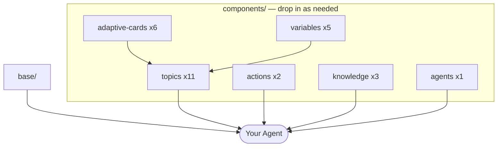

# Components

Drop-in building blocks for Copilot Studio agents. Each component is a self-contained YAML file (or small folder) with built-in error handling, telemetry, and CSAT — copy it into your agent and configure the placeholders.

---

## How components assemble into an agent



Start with `base/` (6 files). Add components from `components/` as your agent needs them. Never write YAML from scratch.

---

## What's here

| Folder | Count | Contents | Use when… |
|--------|-------|----------|-----------|
| [`topics/`](topics/) | 11 | Conversation topic templates | Adding a capability to an agent |
| [`actions/`](actions/) | 2 | Connector and MCP action types | Calling external systems |
| [`knowledge/`](knowledge/) | 3 | Knowledge source types (SharePoint, web, glossary) | Answering questions from documents |
| [`adaptive-cards/`](adaptive-cards/) | 6 | Card templates (confirmation, form, feedback) | Collecting input or showing results |
| [`agents/`](agents/) | 1 | Child agent template | Orchestrator pattern with specialist sub-agents |
| [`variables/`](variables/) | 5 | Global variable templates | Sharing state across topics in a conversation |

---

## How to use a component

```bash
# Step 1 — Copy the component into your agent folder
cp components/topics/escalation/Escalation.topic.mcs.yml \
   agents/<your-agent>/topics/Escalation.topic.mcs.yml

# Step 2 — Replace <SCHEMA> with your agent's schemaName in the file
sed -i 's/<SCHEMA>/<your-schema-name>/g' agents/<your-agent>/topics/Escalation.topic.mcs.yml

# Step 3 — Run the _REPLACE ID script (see docs/QUICKSTART.md → Replace node IDs)

# Step 4 — Replace any remaining <PLACEHOLDER> values (queue names, URLs, etc.)
grep -n "<" agents/<your-agent>/topics/Escalation.topic.mcs.yml
```

### Placeholder convention (applies to all components)

| Placeholder type | Example | Action |
|-----------------|---------|--------|
| `<ANGLE_BRACKETS>` | `<SCHEMA>`, `<SHAREPOINT_URL>` | Replace manually before push |
| `_REPLACE` | `sendActivity_REPLACE` | Replace by running the ID script (see QUICKSTART.md) |
| `schemaName` prefix | `contoso_agent.topic.Escalate` | Follows from your `schemaName` in `agent.mcs.yml` |

### Verify nothing was missed before pushing

```powershell
# Windows PowerShell — both must return zero output before Apply Changes
Get-ChildItem -Recurse -Filter "*.mcs.yml" -Path "agents\<your-agent>" | Select-String "<[A-Za-z]" | Select-Object Filename, LineNumber, Line
Get-ChildItem -Recurse -Filter "*.mcs.yml" -Path "agents\<your-agent>" | Select-String "_REPLACE" | Select-Object Filename, LineNumber, Line
```
```bash
# Mac / Linux
grep -rn "<[A-Za-z]" agents/<your-agent> --include="*.mcs.yml"
grep -rn "_REPLACE" agents/<your-agent> --include="*.mcs.yml"
```

---

## Claude skills for components

| Task | Skill |
|------|-------|
| Generate a new topic from a description | `/copilot-studio:new-topic` |
| Add a connector or MCP action | `/copilot-studio:add-action` |
| Add a knowledge source | `/copilot-studio:add-knowledge` |
| Add an adaptive card to a topic | `/copilot-studio:add-adaptive-card` |
| Validate all component YAML | `/copilot-studio:validate` |

→ Full call signatures and input/output specs: [`../docs/COMPONENT-REGISTRY.md`](../docs/COMPONENT-REGISTRY.md)

---

## Component Quick-Reference

For every component: the exact copy command, every placeholder with an example value, and how to apply.

> **Apply after editing any component file:**
> - Cloud-First (VS Code): `Ctrl+Shift+P → "Copilot Studio: Apply Changes"`
> - CLI (Kit required): `pac copilot push` — see [TOOLS-AND-PLUGINS.md](../docs/TOOLS-AND-PLUGINS.md)

> **Replace `_REPLACE` IDs:** Run the script from [`docs/QUICKSTART.md → Step 4`](../docs/QUICKSTART.md)
> or just save the file in VS Code (extension auto-generates IDs on save).

---

### Base Topics (`base/topics/`)

These 4 files come with every agent. Edit in place — do not copy.

| File | Placeholders | Example / action |
|------|-------------|-----------------|
| `Greeting.topic.mcs.yml` | `_REPLACE1–2` | Run ID script or save in VS Code |
| `Fallback.topic.mcs.yml` | `<AGENT_SCHEMA>` line 53, `_REPLACE1–8` | Set to your schemaName + run ID script |
| `OnError.topic.mcs.yml` | `_REPLACE1–6` | Run ID script |
| `OutOfScope.topic.mcs.yml` | `<out-of-scope phrase 1–5>` lines 24–28, `<DOMAIN>` / `<OUT-OF-SCOPE-TOPIC>` / `<CONTACT>` lines 48–49, `_REPLACE1–2` | Fill domain details + run ID script |

**OutOfScope example** (lines 48–49):
```yaml
# Before
"I'm only set up to help with <DOMAIN>. For <OUT-OF-SCOPE-TOPIC>, contact <CONTACT>."
# After
"I'm only set up to help with HR policies. For IT support, contact it@contoso.com."
```

---

### Topics (`components/topics/`)

> Full guides (when to use, prerequisites, common mistakes): [`topics/README.md`](topics/README.md) → each subfolder README

#### action-invoke — call a connector from a topic (question → action → CSAT)

**Why:** Lets a topic call an external system (e.g. SharePoint, ServiceNow) and return a structured result to the user, with CSAT automatically at the end.

**UI Way:**
1. Copilot Studio portal → Topics (left nav) → + Add topic → From blank
2. Set the display name (e.g. `Get Leave Balance`) and add trigger phrases
3. Use the canvas to add nodes: Question → Call an action (select your connector action) → Message (reference the action output)
4. Save — topic is live in draft immediately

**VS Code Way:**

```bash
cp components/topics/action-invoke/ActionInvoke.topic.mcs.yml agents/<schema>/topics/
```

| Placeholder | Line | Example |
|-------------|------|---------|
| `<Topic Name>` | 2, 14, 28 | `Get Leave Balance` |
| `<trigger phrase 1–5>` | 16–20 | `"check my leave"`, `"how many days off do I have"` |
| `<connector_reference>` | 50 | `shared_sharepointonline` |
| `<OperationId>` | 53 | `GetItem` (run `pac connector show --connector-id shared_sharepointonline` to list) |
| `<param1>` | 55 | `id` (connector input parameter name) |
| `<ActionName>` | 69, 100 | `LeaveBalance` (used in telemetry events) |
| `<AGENT_SCHEMA>` | 92 | `hr_assistant` |
| `<Message using action result>` | 77 | `"Your remaining leave is {Topic.ActionResult.daysLeft} days."` |
| `_REPLACE1–13` | — | Run ID script |

YAML example for the message node:
```yaml
# Before
activities:
  - type: message
    text: <Message using action result>
# After
activities:
  - type: message
    text: "Your remaining leave is {Topic.ActionResult.daysLeft} days."
```

---

#### auth / SignIn — user sign-in gate (ManualAzureAD auth only)

**Why:** Forces the user to authenticate before any sensitive topic runs, ensuring you have a verified identity for M365 calls and audit logging.

**UI Way:**
1. Copilot Studio portal → Topics (left nav) → + Add topic → From blank
2. Set display name to `Sign In` and leave trigger phrases empty (this topic is called programmatically)
3. Add a node: Call an action → select the built-in `Authenticate` action
4. Save

**VS Code Way:**

```bash
cp components/topics/auth/SignIn.topic.mcs.yml agents/<schema>/topics/
```

Only `_REPLACE1–6` — run ID script. No other placeholders.

**Note:** Requires `authenticationMode: ManualAzureAD` in `settings.mcs.yml`.

---

#### conversation-init — load M365 user profile + glossary on first turn

**Why:** Populates `Global.UserDisplayName` and `Global.UserCountry` from the signed-in M365 user so topics can personalise responses without asking the user their name.

**UI Way:**
1. Copilot Studio portal → Topics (left nav) → + Add topic → From blank
2. Set display name to `Conversation Init`; set the trigger to the system event `Conversation Start`
3. Add nodes: Call an action → Office 365 Users → Get my profile; Set variable nodes for `Global.UserDisplayName` and `Global.UserCountry`
4. Save

**VS Code Way:**

```bash
cp components/topics/conversation-init/ConversationInit.topic.mcs.yml agents/<schema>/topics/
cp components/variables/user-display-name/UserDisplayName.variable.mcs.yml agents/<schema>/variables/
cp components/variables/user-country/UserCountry.variable.mcs.yml agents/<schema>/variables/
```

| Placeholder | Line | Example |
|-------------|------|---------|
| `<AGENT-SCHEMA-NAME>` | 14 | `hr_assistant` |
| `_REPLACE1–13` | — | Run ID script |

**Note:** Uses `<AGENT-SCHEMA-NAME>` with hyphens — different from other components that use `<AGENT_SCHEMA>` with underscores. Same value, different format. Requires the Office 365 Users connector connection in the environment. Enables `{Global.UserDisplayName}` and `{Global.UserCountry}` in the system prompt.

---

#### disambiguation — handle 2+ matching topics at once

**Why:** Prevents the agent from silently picking the wrong topic when the user's message could match multiple topics — instead, it asks the user to choose.

**UI Way:**
1. Copilot Studio portal → Topics (left nav) → + Add topic → From blank
2. Set display name to `Disambiguation`; set trigger to the system event `Multiple Topics Matched`
3. Use the canvas to add a Question node listing the matched topic names as options; branch to each topic using Go to topic nodes
4. Save

**VS Code Way:**

```bash
cp components/topics/disambiguation/Disambiguation.topic.mcs.yml agents/<schema>/topics/
```

| Placeholder | Line | Example |
|-------------|------|---------|
| `<AGENT_SCHEMA>` | 70 | `hr_assistant` |
| `_REPLACE1–8` | — | Run ID script |

---

#### escalation — hand off to a live agent queue

**Why:** Provides a graceful exit to a human agent when the bot cannot resolve the user's issue, routing to the correct queue in your contact centre.

**UI Way:**
1. Copilot Studio portal → Topics (left nav) → + Add topic → From blank
2. Set display name to `Escalate to Agent` and add trigger phrases such as `"speak to a human"`, `"agent please"`
3. Add a node: Call an action → Transfer conversation (select the target queue by name)
4. Save

**VS Code Way:**

```bash
cp components/topics/escalation/Escalation.topic.mcs.yml agents/<schema>/topics/
```

| Placeholder | Line | Example |
|-------------|------|---------|
| `<EscalationQueueName>` | 63 | `IT Support Queue` |
| `_REPLACE1–3` | — | Run ID script |

YAML example:
```yaml
# Before
transferTarget: <EscalationQueueName>
# After
transferTarget: IT Support Queue
```

---

#### feedback — CSAT at end of conversation (thumbs / star rating / category)

**Why:** Captures structured end-of-conversation satisfaction data (thumbs, star rating, and free-text category) that flows into Power BI or Dataverse for quality monitoring.

**UI Way:**
1. Copilot Studio portal → Topics (left nav) → + Add topic → From blank
2. Set display name to `Feedback`; set trigger to the system event `Conversation End`
3. Add Send a message nodes referencing the three adaptive card JSON files for thumbs, rating, and text input
4. Save — copy all three feedback JSON cards together

**VS Code Way:**

```bash
cp components/topics/feedback/Feedback.topic.mcs.yml agents/<schema>/topics/
cp components/adaptive-cards/feedback-thumbs.json agents/<schema>/adaptive-cards/
cp components/adaptive-cards/feedback-rating.json agents/<schema>/adaptive-cards/
cp components/adaptive-cards/feedback-text.json agents/<schema>/adaptive-cards/
```

| Placeholder | Line | Example |
|-------------|------|---------|
| `<SCHEMA>` | 14, 172 | `hr_assistant` |
| `_REPLACE1–27` | — | Run ID script (27 IDs — do not skip any) |

The feedback JSON cards have no placeholders — they work as-is.

---

#### out-of-scope — redirect questions outside agent scope

**Why:** Catches questions the agent is not designed to answer and returns a helpful redirect message rather than a confusing non-answer.

**UI Way:**
1. Copilot Studio portal → Topics (left nav) → + Add topic → From blank
2. Set display name to `Out of Scope`; set trigger to the system event `No Topics Matched`
3. Add trigger phrases for the specific out-of-scope domains (e.g. `payroll`, `expense reimbursement`)
4. Add a Message node with the redirect text referencing `<DOMAIN>`, `<OUT-OF-SCOPE-TOPIC>`, and `<CONTACT>`; Save

**VS Code Way:**

```bash
cp components/topics/out-of-scope/OutOfScope.topic.mcs.yml agents/<schema>/topics/
```

| Placeholder | Line | Example |
|-------------|------|---------|
| `<out-of-scope phrase 1–5>` | 24–28 | `payroll`, `expense reimbursement` |
| `<DOMAIN>` | 48 | `HR policies` |
| `<OUT-OF-SCOPE-TOPIC>` | 48 | `IT support` |
| `<CONTACT>` | 49 | `it@contoso.com` |
| `_REPLACE1–2` | — | Run ID script |

YAML example (lines 48–49):
```yaml
# Before
"I'm only set up to help with <DOMAIN>. For <OUT-OF-SCOPE-TOPIC>, contact <CONTACT>."
# After
"I'm only set up to help with HR policies. For IT support, contact it@contoso.com."
```

---

#### question-branch — ask a question, branch on the answer

**Why:** Handles any scenario where the correct response depends on the user's answer to a single question — avoids duplicating similar topics for each variant.

**UI Way:**
1. Copilot Studio portal → Topics (left nav) → + Add topic → From blank
2. Set the display name and add trigger phrases
3. Add a Question node; add two or more condition branches off the question; add a Message node on each branch for the response; add a final Message node on the Else branch for the fallback
4. Save

**VS Code Way:**

```bash
cp components/topics/question-branch/QuestionBranch.topic.mcs.yml agents/<schema>/topics/
```

| Placeholder | Example |
|-------------|---------|
| `<Topic Name>` | `Check Employment Type` |
| `<trigger phrase 1–5>` | `"am I full time"`, `"what's my employment type"` |
| `<Intro message>` | `"I can help with that."` |
| `<Question prompt text>` | `"Are you full-time or part-time?"` |
| `<Option 1>` / `<Option 2>` | `Full-time` / `Part-time` |
| `<Response for Option 1>` | Answer text for the first branch |
| `<Response for Option 2>` | Answer text for the second branch |
| `<Fallback response>` | `"I'll need to check with HR on that."` |
| `_REPLACE0–8` | Run ID script (note: starts at 0, not 1) |

YAML example for the question node:
```yaml
# Before
prompt: <Question prompt text>
choices:
  - <Option 1>
  - <Option 2>
# After
prompt: "Are you full-time or part-time?"
choices:
  - Full-time
  - Part-time
```

---

#### remove-citations — strip [1]–[10] citation markers from AI responses

**Why:** Keeps AI-generated answers clean in channels (Teams, web chat) where inline citation numbers look like formatting noise rather than useful references.

**UI Way:**
1. Copilot Studio portal → Topics (left nav) → + Add topic → From blank
2. Set display name to `Remove Citations`; configure it to run on every AI-generated message by calling it from the Generative Answers node output
3. Add a series of Set variable nodes using `Substitute()` to strip `[1]` through `[10]` from the response string
4. Save

**VS Code Way:**

```bash
cp components/topics/remove-citations/RemoveCitations.topic.mcs.yml agents/<schema>/topics/
```

Only `_REPLACE1–3` — run ID script. No other placeholders.

**Note:** Only strips markers [1] through [10]. Add more replace steps in the topic YAML if your knowledge source returns more than 10 citations.

---

### Actions (`components/actions/`)

#### connector-action — call a Power Platform connector

**Why:** Exposes any Power Platform connector operation (SharePoint, ServiceNow, SQL, etc.) as a named action that topics and AI orchestration can call directly.

**UI Way:**
1. Copilot Studio portal → Actions (left nav) → + Add action → New action → Connector
2. Search for the connector (e.g. SharePoint, ServiceNow)
3. Select the operation (e.g. `Get item`), configure fixed inputs (site URL) and mark dynamic inputs (item ID)
4. Save → the action is now available to all topics and AI orchestration

**VS Code Way:**

```bash
cp components/actions/connector/connector-action.mcs.yml \
   agents/<schema>/actions/<ActionName>.mcs.yml
```

| Placeholder | Example |
|-------------|---------|
| `<connection-reference-logical-name>` | `shared_sharepointonline` |
| `<OperationId>` | `GetItem` |
| `<FixedPropertyName>` / `<Fixed Value>` | `dataset` / `"https://contoso.sharepoint.com/sites/HR"` |
| `<DynamicPropertyName>` | `id` (value provided by topic or AI at runtime) |
| `<Short display name>` | `Get HR Policy Document` |
| `<One sentence description>` | `Retrieves an HR policy document by ID from SharePoint.` |

Find the `<OperationId>` for any connector:
```bash
pac connector show --connector-id shared_sharepointonline
```

YAML example:
```yaml
# Before
connectionReference: <connection-reference-logical-name>
operationId: <OperationId>
displayName: <Short display name>
description: <One sentence description>
# After
connectionReference: shared_sharepointonline
operationId: GetItem
displayName: Get HR Policy Document
description: Retrieves an HR policy document by ID from SharePoint.
```

---

#### mcp-action — call an MCP (Model Context Protocol) tool

**Why:** Connects the agent to any MCP-compatible server (internal knowledge bases, custom APIs, developer tools) using a standardised protocol without writing connector code.

**UI Way:**
1. Copilot Studio portal → Actions (left nav) → + Add action → New action → Model Context Protocol (MCP)
2. Enter the MCP server URL and authorize the connection
3. Select the tool to enable (e.g. `search_articles`)
4. Save → the MCP tool is now available to all topics and AI orchestration

**VS Code Way:**

```bash
cp components/actions/mcp/mcp-action.mcs.yml \
   agents/<schema>/actions/<ToolName>.mcs.yml
```

| Placeholder | Example |
|-------------|---------|
| `<connection-reference-logical-name>` | `shared_mcp_knowledgebase` |
| `<mcp_OperationId>` | `search_articles` |
| `<Short display name>` | `Search Knowledge Base` |
| `<One sentence description>` | `Searches the internal knowledge base for relevant articles.` |

**Note:** MCP tools define their own inputs/outputs — no input/output blocks are needed in the YAML.

---

### Adaptive Cards (`components/adaptive-cards/`)

**Why:** Adaptive Cards provide structured, interactive UI in any channel that supports them (Teams, web chat), replacing plain-text prompts for confirmations, forms, and status displays.

**UI Way:**
1. Copilot Studio portal → Topics → open a topic → + Add node → Send a message → Message format: Adaptive Card
2. Paste the JSON from `components/adaptive-cards/` into the card editor
3. Replace `${placeholders}` with Power Fx expressions in the DataContext field
4. Save

**VS Code Way:**

Copy the card JSON into your agent folder and reference it from a SendActivity node.

| Card file | Runtime placeholders | When to use |
|-----------|---------------------|-------------|
| `confirmation-card.json` | `${title}`, `${message}`, `${confirmLabel}`, `${cancelLabel}` | Confirming a write or destructive action (Safety tier 2–3) |
| `form-card.json` | `${title}`, `${field1Label}`, `${field2Label}`, `${field3Choices}`, `${submitLabel}` | Collecting multi-field user input |
| `status-card.json` | `${statusLabel}`, `${title}`, `${statusColor}`, `${actionUrl}` | Showing a status or result |
| `feedback-thumbs.json` | None (hardcoded) | Used by Feedback topic — copy all 3 feedback cards together |
| `feedback-rating.json` | None (hardcoded) | Used by Feedback topic |
| `feedback-text.json` | None (hardcoded) | Used by Feedback topic |

Inject `${...}` values at runtime via `DataContext` Power Fx in the SendActivity node:

```yaml
DataContext: =
  {
    title: "Confirm leave request",
    message: "Submit 3 days annual leave from Monday?",
    confirmLabel: "Yes, submit",
    cancelLabel: "Cancel"
  }
```

---

### Knowledge Sources (`components/knowledge/`)

#### sharepoint — answer questions from SharePoint documents

**Why:** Lets the agent answer questions grounded in your organisation's SharePoint documents (policies, procedures, guides) without any manual copy-paste of content.

**UI Way:**
1. Copilot Studio portal → Knowledge (left nav) → + Add knowledge
2. Select source type: SharePoint
3. Enter the SharePoint folder URL (e.g. `https://contoso.sharepoint.com/sites/HR/Shared%20Documents/Policies`)
4. Save — indexing runs automatically (takes 5–30 min for SharePoint)

**VS Code Way:**

```bash
cp components/knowledge/sharepoint/sharepoint.knowledge.mcs.yml \
   agents/<schema>/knowledge/
```

| Placeholder | Line | Example |
|-------------|------|---------|
| SharePoint folder URL | 9 | `https://contoso.sharepoint.com/sites/HR/Shared%20Documents/Policies` |

YAML example:
```yaml
# Before
url: <SharePoint folder URL>
# After
url: https://contoso.sharepoint.com/sites/HR/Shared%20Documents/Policies
```

Rules:
- URL must be URL-encoded (spaces → `%20`)
- Folder-level URL preferred over site-level (keeps scope narrow)
- Service principal or signed-in user needs at least **Read** on the folder
- Indexed file types: `.docx`, `.pdf`, `.pptx`, `.xlsx`

---

#### public-website — answer questions from public web pages (Bing-backed)

**Why:** Grounds answers in publicly available documentation (product docs, support articles, public policy pages) without needing to import or sync any files.

**UI Way:**
1. Copilot Studio portal → Knowledge (left nav) → + Add knowledge
2. Select source type: Public website
3. Enter the website URL (e.g. `https://docs.contoso.com`)
4. Save — indexing runs automatically

**VS Code Way:**

```bash
cp components/knowledge/public-website/public-website.knowledge.mcs.yml \
   agents/<schema>/knowledge/
```

| Placeholder | Line | Example |
|-------------|------|---------|
| Website URL | 10 | `https://docs.contoso.com` |

YAML example:
```yaml
# Before
url: <Website URL>
# After
url: https://docs.contoso.com
```

Rules:
- URL must be publicly crawlable by Bing (no auth, no intranet)
- Max depth: 2 levels from the root URL

---

#### glossary — expand acronyms silently in AI context

**Why:** Ensures the AI correctly interprets domain acronyms (PTO, WFH, L&D) by injecting a term list into every conversation turn, without surfacing the expansion to the user.

**UI Way:**
1. Copilot Studio portal → Knowledge (left nav) → + Add knowledge
2. Select source type: Dataverse
3. Point to the Dataverse table that holds your glossary term/definition rows
4. Save — terms are injected into AI context automatically via the conversation-init topic

**VS Code Way:**

```bash
cp components/knowledge/glossary/glossary.knowledge.mcs.yml agents/<schema>/knowledge/
cp components/variables/glossary-var/Glossary.variable.mcs.yml agents/<schema>/variables/
# Also add the conversation-init topic (loads the glossary CSV on first turn)
```

In `Glossary.variable.mcs.yml`:

| Placeholder | Example |
|-------------|---------|
| `<AGENT-SCHEMA-NAME>` | `hr_assistant` |

Glossary data format (stored in Dataverse, NOT in YAML):
```
PTO,Paid Time Off
WFH,Work From Home
L&D,Learning and Development
```

---

### Variables (`components/variables/`)

> Full guides (prerequisites, Apply Changes limitation, common mistakes): [`variables/README.md`](variables/README.md) → each subfolder README

#### UserDisplayName / UserCountry — M365 profile loaded on first turn

**Why:** Makes the agent feel personal by addressing users by name and adapting responses to their location — both drawn automatically from their M365 profile.

**UI Way:**
1. Copilot Studio portal → Variables (left nav, under Settings) → + New variable
2. Set name to `UserDisplayName`, type to String, scope to Global, leave default value blank
3. Repeat for `UserCountry`
4. Variable is immediately available as `{Global.UserDisplayName}` and `{Global.UserCountry}` in all topics

**VS Code Way:**

```bash
cp components/variables/user-display-name/UserDisplayName.variable.mcs.yml agents/<schema>/variables/
cp components/variables/user-country/UserCountry.variable.mcs.yml agents/<schema>/variables/
```

In both files, replace `<AGENT-SCHEMA-NAME>` with your schemaName (e.g. `hr_assistant`).

YAML example:
```yaml
# Before
schemaName: <AGENT-SCHEMA-NAME>.globalvariable.UserDisplayName
# After
schemaName: hr_assistant.globalvariable.UserDisplayName
```

**Note:** Requires: `conversation-init` topic + `IntegratedAzureAD` or `ManualAzureAD` auth. Used in system prompt as `{Global.UserDisplayName}` and `{Global.UserCountry}`.
See [Apply Changes limitation](variables/user-display-name/README.md) before pushing variable files.

---

#### Glossary variable — share acronym data across topics

**Why:** Holds the loaded glossary CSV string in a global variable so every topic can reference domain term expansions without re-querying Dataverse on each turn.

**UI Way:**
1. Copilot Studio portal → Variables (left nav, under Settings) → + New variable
2. Set name to `Glossary`, type to String, scope to Global, leave default value blank
3. Variable is populated by the conversation-init topic on first turn and available as `{Global.Glossary}`

**VS Code Way:**

```bash
cp components/variables/glossary-var/Glossary.variable.mcs.yml agents/<schema>/variables/
```

| Placeholder | Example |
|-------------|---------|
| `<AGENT-SCHEMA-NAME>` | `hr_assistant` |

**Note:** Requires: `glossary` knowledge source + `conversation-init` topic.

---

#### Custom global variable — share any value across topics

**Why:** Provides a reusable template for any piece of state (ticket number, selected department, session flag) that needs to persist across multiple topics in a conversation.

**UI Way:**
1. Copilot Studio portal → Variables (left nav, under Settings) → + New variable
2. Set name, type (String/Number/Boolean/Table/Record), scope (Global), and optionally a default value
3. Variable is immediately available as `{Global.VariableName}` in all topics

**VS Code Way:**

```bash
cp components/variables/global-variable/global-variable.variable.mcs.yml \
   agents/<schema>/variables/<VarName>.variable.mcs.yml
```

| Placeholder | Example |
|-------------|---------|
| `_REPLACE_NAME` | `TicketNumber` (also used as the variable name) |
| `_REPLACE_SCHEMA_PREFIX` | `hr_assistant` (your schemaName) |

YAML example:
```yaml
# Before
schemaName: _REPLACE_SCHEMA_PREFIX.globalvariable._REPLACE_NAME
# After
schemaName: hr_assistant.globalvariable.TicketNumber
```

---

### Child Agents (`components/agents/`)

#### child-agent — delegate a domain to a specialist sub-agent

**Why:** Enables an orchestrator pattern where a top-level agent routes user requests to domain-specialist sub-agents, keeping each agent focused and its topic list manageable.

**UI Way:**
1. Copilot Studio portal → (parent agent) → Actions (left nav) → + Add action → New action → Agent
2. Search for the child agent in your environment
3. Write the description that tells the parent agent when to route to this child (be specific — vague descriptions cause missed routing)
4. Save

**VS Code Way:**

```bash
cp components/agents/child-agent/child-agent.mcs.yml \
   agents/<schema>/agents/<SpecialistName>/child-agent.mcs.yml
```

| Placeholder | Lines | Example |
|-------------|-------|---------|
| Description block | 13–18 | `"Handles all questions about leave policies, leave balances, and requests. Use this when the user asks about annual leave, sick leave, or parental leave."` |

YAML example:
```yaml
# Before
description: |
  <Description block>
# After
description: |
  Handles all questions about leave policies, leave balances, and requests.
  Use this when the user asks about annual leave, sick leave, or parental leave.
  Do not use this for payroll or expense queries.
```

**Note:** The parent agent routes to this child based on the description. Be specific — vague descriptions cause missed routing. Do not list topics the parent agent handles.
