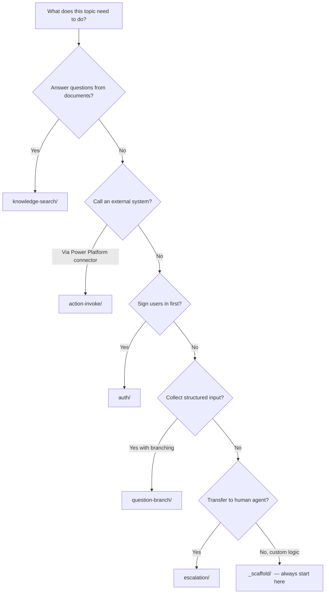

# Topic Components

11 drop-in conversation topic templates. Each fires telemetry, handles errors, and chains to the Feedback topic — nothing to add manually.

---

## Topics

| Folder | Primary trigger | Also callable via | Purpose |
|--------|----------------|-------------------|---------|
| [`_scaffold/`](_scaffold/) | `OnRecognizedIntent` | — | **Start here for every new topic** — error handling, telemetry, CSAT guard |
| [`action-invoke/`](action-invoke/) | `OnRecognizedIntent` | `BeginDialog` | Calls a connector action with output validation and telemetry |
| [`auth/`](auth/) | `OnSignIn` | — | Sign-in flow with `Auth.SignInStarted` / `Auth.SignInCompleted` telemetry |
| [`conversation-init/`](conversation-init/) | `OnActivity` (first message) | — | Loads M365 user profile (`UserDisplayName`, `UserCountry`) and glossary into global variables |
| [`disambiguation/`](disambiguation/) | `OnSelectIntent` | — | Clarifies ambiguous intents, logs `Agent.DisambiguationTriggered` |
| [`escalation/`](escalation/) | `OnRecognizedIntent` (12 phrases) | `BeginDialog` from Fallback | Human handoff via `TransferConversation`, logs `Agent.EscalationTriggered` |
| [`feedback/`](feedback/) | `OnRecognizedIntent` / `BeginDialog` | — | Thumbs → rating → issue category dropdown CSAT |
| [`knowledge-search/`](knowledge-search/) | `OnUnknownIntent` | — | Generative answers from knowledge sources, logs `Knowledge.AnswerFound` / `AnswerNotFound` |
| [`out-of-scope/`](out-of-scope/) | `OnRecognizedIntent` | — | Redirects queries outside the agent's domain, logs `Agent.OutOfScope` |
| [`question-branch/`](question-branch/) | `OnRecognizedIntent` | — | Collects user input and branches the conversation |
| [`remove-citations/`](remove-citations/) | `OnGeneratedResponse` | — | Strips `[1][2]` citation markers from AI-generated responses |

---

## Which topic do I need?



**Notes:**
- `conversation-init/` — add to every authenticated agent (loads user profile once per session)
- `feedback/` — add to every production agent (CSAT collection)
- `remove-citations/` — add when using `knowledge-search/` (removes `[1][2]` markers)
- `out-of-scope/` — add to every agent as a guardrail
- `disambiguation/` — add when multiple topics have overlapping trigger phrases

---

## Usage rule

**Never write a topic from scratch.** Always copy `_scaffold/` first, then add your logic to the MAIN LOGIC section. This guarantees telemetry and error handling are present.

```bash
# Step 1 — copy scaffold
cp components/topics/_scaffold/TopicScaffold.topic.mcs.yml \
   agents/<your-agent>/topics/<TopicName>.topic.mcs.yml

# Step 2 — replace schema placeholder
sed -i 's/<SCHEMA>/<your-schema-name>/g' agents/<your-agent>/topics/<TopicName>.topic.mcs.yml

# Step 3 — add your logic in the MAIN LOGIC section
# Step 4 — run the _REPLACE ID script (see docs/QUICKSTART.md → Replace node IDs)
```

→ Detailed scaffold guide: [`_scaffold/README.md`](_scaffold/README.md)
→ Call signatures and inputs/outputs for each topic: [`../../docs/COMPONENT-REGISTRY.md`](../../docs/COMPONENT-REGISTRY.md)
→ Claude skills: `/copilot-studio:new-topic` generates a complete topic from plain English
