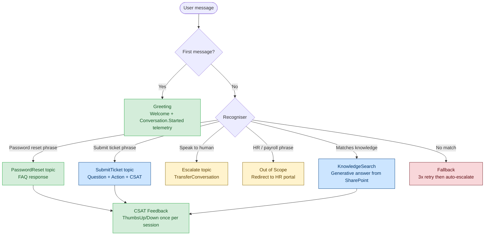

# Team Demo Agent — IT Support Assistant

A complete, workable Copilot Studio agent you can build live in 30 minutes to show the team how every template fits together. Covers: greeting, FAQ topic, action topic, out-of-scope, fallback, CSAT.

---

## What this agent does

An internal IT Support agent for Microsoft Teams. Users can:
- Ask common IT questions (answered from a SharePoint knowledge base)
- Reset their password (a simple FAQ response)
- Submit an IT support ticket (a connector action)
- Speak to a human agent (escalation)

Everything else redirects cleanly. The agent never crashes silently.

---

## Conversation flow



---

## Step 1 — Scaffold the agent (5 min)

```bash
# From repo root
cp -r base/ agents/it_support_demo/

# Rename topics to match the schema
cd agents/it_support_demo
```

Open `agent.mcs.yml` and set:
```yaml
name: it_support_demo
displayName: IT Support Assistant
instructions: |
  You are an IT Support assistant for Contoso. Help employees with common IT issues,
  password resets, and ticket submission. If a question is not IT-related, redirect
  politely to the correct team. Never guess — say so and offer to escalate.
conversationStarters:
  - How do I reset my password?
  - Submit an IT ticket
  - My laptop won't connect to WiFi
  - I need help with my VPN
```

Open `settings.mcs.yml` and set:
```yaml
schemaName: it_support_demo
authenticationMode: IntegratedAzureAD   # Silent SSO via Teams — no sign-in prompt
```

---

## Step 2 — Add the Greeting topic (already in base)

`base/topics/Greeting.topic.mcs.yml` is already wired. Just update the welcome message:

```yaml
# In Greeting.topic.mcs.yml — find the SendActivity and change:
activity: >-
  Hi {Global.UserDisplayName}! I'm your IT Support assistant.
  I can help with password resets, ticket submission, and common IT questions.
  What can I help you with today?
```

**What this shows the team:** Every agent starts with a greeting. The `{Global.UserDisplayName}` token comes from ConversationInit — no extra code needed.

---

## Step 3 — Add a simple FAQ topic (10 min)

Copy the scaffold and build the password reset topic:

```bash
cp components/topics/_scaffold/TopicScaffold.topic.mcs.yml \
   agents/it_support_demo/topics/PasswordReset.topic.mcs.yml
```

**Key sections to fill in** (`PasswordReset.topic.mcs.yml`):

```yaml
# 1. Intent — what phrases trigger this topic
intent:
  displayName: Password Reset
  triggerQueries:
    - reset my password
    - forgot my password
    - password expired
    - change my password
    - how do I reset my password
    - locked out of my account
    - can't log in

# 2. Main logic (Option A — informational response, no action needed)
# Replace the SendActivity in section 2 of the scaffold:
- kind: SendActivity
  id: sendResponse_REPLACE2
  activity: >-
    To reset your password:
    1. Go to **aka.ms/sspr** (Self-Service Password Reset)
    2. Enter your work email and follow the prompts
    3. You'll receive a verification code on your registered mobile number

    If SSPR is not working, I can connect you to the IT helpdesk.
    Just say **"speak to a human"** and I'll transfer you.
```

**What this shows the team:** FAQ topics are 3 steps — copy scaffold, add triggers, write the response. No connector needed. The telemetry (`Topic.Started`, `Topic.Completed`) comes for free from the scaffold.

---

## Step 4 — Add an action topic (10 min)

This is the most important demo — shows a connector action with input validation and CSAT.

```bash
cp components/topics/action-invoke/ActionInvoke.topic.mcs.yml \
   agents/it_support_demo/topics/SubmitTicket.topic.mcs.yml
```

**Fill in `SubmitTicket.topic.mcs.yml`:**

```yaml
# Intent
intent:
  displayName: Submit IT Ticket
  triggerQueries:
    - submit a ticket
    - raise an IT request
    - log a support ticket
    - I need IT support
    - create a service request
    - report an issue

# Question — collect the issue before calling the action
- kind: Question
  id: askInput_REPLACE2
  variable: init:Topic.UserInput
  prompt: Briefly describe the issue — what's happening and since when?
  entity: StringPrebuiltEntity
  alwaysPrompt: true

# Action — call ServiceNow (or any PP connector)
- kind: InvokeConnectorAction
  id: callAction_REPLACE3
  output:
    kind: SingleVariableOutputBinding
    variable: init:Topic.ActionResult
  connectionReference: shared_servicenow          # swap for your connector
  connectionProperties:
    mode: Invoker
  operationId: CreateIncident
  parameters:
    short_description: =Topic.UserInput
    caller_id: =System.User.Id
    urgency: "3"                                   # Low by default

# Success message (inside the successBranch condition)
- kind: SendActivity
  id: sendResult_REPLACE7
  activity: >-
    Your ticket has been raised! Reference: **{Topic.ActionResult.number}**
    The IT team typically responds within 4 business hours.
    You'll receive an email confirmation shortly.

# Error message (inside elseActions)
- kind: SendActivity
  id: sendErrorMessage_REPLACE13
  activity: >-
    Sorry, I wasn't able to submit the ticket right now.
    You can raise one directly at **helpdesk.contoso.com** or say
    **"speak to a human"** and I'll connect you to the team.
```

**What this shows the team:**
- The action template handles the success/failure branching automatically
- CSAT fires automatically after success (built into ActionInvoke template)
- Error messages never expose internals — just a safe user-facing message
- Safety tier: Medium (write action) — add confirmation card if needed

---

## Step 5 — Add Out of Scope and knowledge search (5 min)

```bash
# Out of scope — redirect HR/payroll questions
cp components/topics/out-of-scope/OutOfScope.topic.mcs.yml \
   agents/it_support_demo/topics/OutOfScope.topic.mcs.yml

# Knowledge search — answer general IT questions from SharePoint
cp components/knowledge/sharepoint/sharepoint.knowledge.mcs.yml \
   agents/it_support_demo/knowledge/ITKnowledge.knowledge.mcs.yml
cp components/topics/knowledge-search/KnowledgeSearch.topic.mcs.yml \
   agents/it_support_demo/topics/KnowledgeSearch.topic.mcs.yml
```

In `OutOfScope.topic.mcs.yml`, add:
```yaml
triggerQueries:
  - payroll
  - salary
  - HR policy
  - annual leave
  - benefits
  - expense claim

# Update the SendActivity:
activity: That's an HR question — I'm set up for IT support only.
  For HR queries, visit the HR portal at hr.contoso.com or contact hr@contoso.com.
  Is there anything IT-related I can help with?
```

In `ITKnowledge.knowledge.mcs.yml`, set:
```yaml
displayName: IT Knowledge Base
siteUrl: https://contoso.sharepoint.com/sites/IT-KB    # your SharePoint site
```

---

## Step 6 — Replace all placeholders and push (5 min)

### Demo agent placeholder values

| Placeholder | Value for this demo |
|-------------|-------------------|
| `componentName` / `schemaName` | `it_support_demo` |
| `displayName` | `IT Support Assistant` |
| `<AGENT_SCHEMA>` in `Fallback.topic.mcs.yml` line 53 | `it_support_demo` |
| `_REPLACE` node IDs | Run script below |

### Replace IDs (PowerShell)

```powershell
$schema = "it_support_demo"
$folder = "agents\$schema"

Get-ChildItem -Recurse -Filter "*.mcs.yml" -Path $folder | ForEach-Object {
    $content = Get-Content $_.FullName -Raw
    while ($content -match '_REPLACE\d*') {
        $id = -join ((97..122) + (48..57) | Get-Random -Count 6 | ForEach-Object {[char]$_})
        $content = [regex]::Replace($content, '_REPLACE\d*', "_$id", 1)
    }
    Set-Content $_.FullName $content
}
Get-ChildItem -Recurse -Filter "*.mcs.yml" -Path $folder |
    ForEach-Object { (Get-Content $_.FullName) -replace '<AGENT_SCHEMA>', $schema |
    Set-Content $_.FullName }
```

### Push to cloud — choose your path before the demo

**Path A — Cloud-First (recommended for demos — zero extra tools)**

> Use this path — it requires no extra tools beyond VS Code and the Copilot Studio extension.

```
1. Browser: make.preview.microsoft.com → Create → New blank agent "IT Support Assistant Demo" → Create

2. VS Code: Ctrl+Shift+P → "Copilot Studio: Clone Agent"
   → sign in → select Demo environment → select "IT Support Assistant Demo"
   → output folder: agents/it_support_demo_cloud/

3. Copy your edited YAML files from agents/it_support_demo/ into the cloned folder
   (overwrite agent.mcs.yml, settings.mcs.yml, and all topic files)

4. VS Code: Ctrl+Shift+P → "Copilot Studio: Apply Changes"
   → uploads all YAML as a draft
```

**Path B — CLI-only (no VS Code extension required for push):**

> Not available via `pac copilot push` — that command does not exist.
> To create the agent without the browser UI, use `pac copilot create` with a template YAML file.
> For the demo, use Path A — it is simpler and requires no extra tools.

---

## The final folder structure

```
agents/
└── it_support_demo/
    ├── agent.mcs.yml                    ← identity, system prompt
    ├── settings.mcs.yml                 ← schemaName, IntegratedAzureAD auth
    ├── topics/
    │   ├── Greeting.topic.mcs.yml       ← from base/
    │   ├── Fallback.topic.mcs.yml       ← from base/
    │   ├── OnError.topic.mcs.yml        ← from base/
    │   ├── OutOfScope.topic.mcs.yml     ← from base/ (HR, payroll redirects)
    │   ├── PasswordReset.topic.mcs.yml  ← scaffold — FAQ response
    │   ├── SubmitTicket.topic.mcs.yml   ← action-invoke — ServiceNow
    │   ├── KnowledgeSearch.topic.mcs.yml← generative IT answers
    │   └── Escalation.topic.mcs.yml     ← from components/
    ├── knowledge/
    │   └── ITKnowledge.knowledge.mcs.yml← SharePoint IT KB
    └── variables/
        ├── UserDisplayName.variable.mcs.yml
        └── FeedbackShown.variable.mcs.yml
```

**Total files: 13. Time to build: ~30 min.**

---

## What to say during the demo

| Slide | Say |
|-------|-----|
| Flow diagram | "Every request hits the recogniser. The YAML triggers route it to the right topic — the agent never guesses." |
| Greeting topic | "This is the base. Every agent gets this for free. It fires telemetry on session start automatically." |
| PasswordReset | "Copy scaffold, add 6 trigger phrases, write one response. That's it. Error handling and telemetry are already there." |
| SubmitTicket | "The action template wires the connector call, the success/failure branches, and the CSAT prompt in one file. You only fill in the connector and the messages." |
| OutOfScope | "This is your guardrail. When a user asks something outside IT, they get a clear redirect — not 'I don't understand'." |
| Push (Path A) | "We created the agent in the browser, cloned it locally with VS Code, edited the YAML, then hit Apply Changes. The draft is live in seconds — no extra tools needed." |
| Push (Path B) | "We edit YAML locally in VS Code, then hit 'Apply Changes'. The extension syncs the draft to Copilot Studio in seconds — no CLI tool needed." |
| Telemetry | "Every topic fires `Topic.Started`. Every action fires `Action.Succeeded` or `Action.Failed`. On day one, Application Insights is already populated." |

---

## What NOT to demo

- Authentication topics (adds 10 min of setup)
- Child agents / orchestrator pattern (save for a follow-up)
- CI/CD pipeline (run separately — not part of the agent itself)

These are great follow-up topics once the team has built their first agent.

---

## Next steps after the demo

1. Each developer picks one recipe from `recipes/` that matches their first real ticket
2. Replace `it_support_demo` with the real agent schemaName
3. Add real SharePoint URL and connector reference
4. Run the eval CSV (50 test cases minimum) before pushing to UAT
5. Complete `governance/ai-ethics-checklist.md` — required before UAT

→ Full build guide: [ENGINEERING-PLAYBOOK.md](../../ENGINEERING-PLAYBOOK.md)
→ Template library: [docs/TEMPLATES.md](../../docs/TEMPLATES.md)
→ Quickstart (creation paths + placeholder guide): [docs/QUICKSTART.md](../../docs/QUICKSTART.md)
